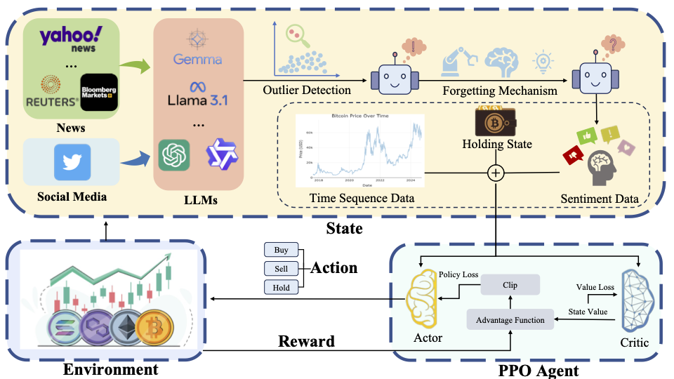
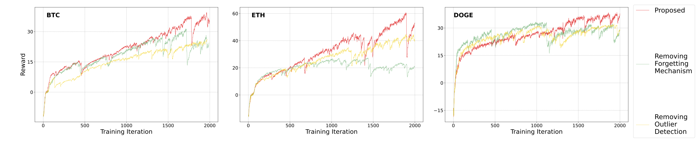
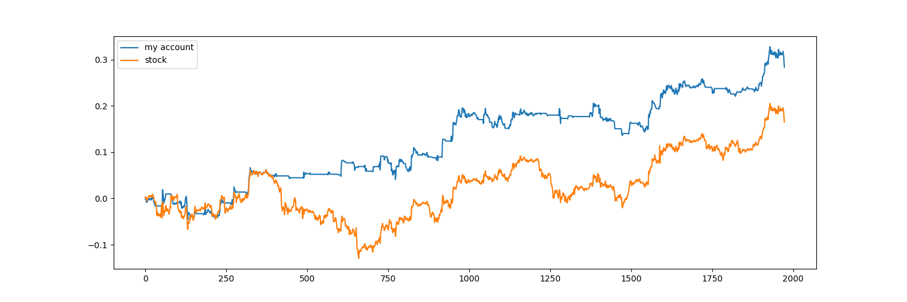
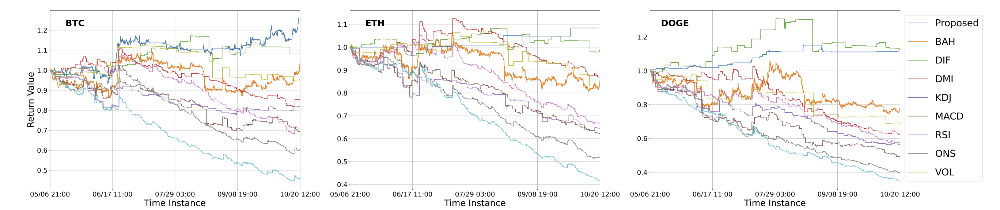

## Project Overview
This repository is a section of the reinforcement learning module of a larger cryptocurrency trading system that integrates multi-source sentiment analysis from large language models (LLMs) with deep reinforcement learning. In the full system, LLM-generated sentiment signals are filtered using a “Trust-the-Majority” strategy and dynamically weighted based on the Ebbinghaus Forgetting Curve to reflect their decaying market impact.

**My contribution focuses on the design and implementation of the downstream reinforcement learning framework.** Specifically, I developed a high-frequency trading module using the Proximal Policy Optimization (PPO) algorithm in PyTorch, augmented with an LSTM-based architecture to capture temporal dependencies in both market data and sentiment signals. 
- The agent observes a state space constructed from a sliding window of technical indicators (e.g., EMA, MACD, RSI, KDJ) and sentiment scores derived from LLM outputs.
- To guide the agent’s learning, I designed a composite reward function that incorporates return on investment (ROI) as the primary signal, while introducing a volatility penalty to control excessive risk-taking behavior. The module also implements data normalization (Z-score + outlier truncation), dynamic action sampling, and action interpretation for buy/hold/sell decisions.
- I was also responsible for the full training loop, backtesting pipeline, and performance visualization tools. This includes model checkpointing, Sharpe ratio evaluation, trade signal plotting, and simulation-based validation on unseen market data.

---

## Features

- LSTM-enhanced PPO for time-aware decisions
- Technical + sentiment features
- Visualization of trades, rewards, and profits
- Custom trading environment
- Supports GPU acceleration with PyTorch

---

## Module Justification

### `RL_brain.py` — Core PPO Agent Module

This module implements the Proximal Policy Optimization (PPO) agent used for reinforcement learning. It defines both the policy and value networks, and includes the full training pipeline. Key responsibilities:

- Model Architecture:
    - Combines `MLP + LSTM` for both feature extraction and temporal modeling.
    - `pi()` outputs the probability distribution over actions (policy network).
    - `v()` estimates the expected value of the current state (value network).
- Core Training Logic `train_net()`:
    - Computes `Generalized Advantage Estimation (GAE)` to stabilize training.
    - Constructs `PPO-Clip loss` to restrict policy updates within a trust region.
    - Optimizes both actor and critic networks simultaneously.
- Experience Buffer Management:
    - `put_data()` and `make_batch()` handle collection and batching of experiences.
    - Experience buffer is cleared after each episode to maintain on-policy training.

### `stock_env.py`

This module simulates a time-aware stock trading environment with technical and sentiment-based features. It serves as the interface between the PPO agent and market simulation. Core features:

- State Representation:
    - Each state consists of 24 historical time steps of technical indicators + sentiment signals (44 features × 24 = 1056), plus a holding flag → total input dim: 1057.
    - Provides temporal structure to help the agent capture trading patterns.
- Action Space:
    - 3 discrete actions: `Buy`, `Sell`, `Hold/Cash`.
    - Updates portfolio position based on selected action.
- Reward Function Design:
    - Computes return as:
        `(price[t+1]−price[t])/price[t]`
    - Includes transaction costs and position penalties.
    - Encourages profitable trading behavior and penalizes unnecessary trades or missed opportunities.
- Visualization Support:
    `draw()` method for plotting trading actions and cumulative returns, useful for backtesting analysis.

### `run_this(ppo).py`

This is the main execution script that integrates agent, environment, training loop, and evaluation. Core functions:
- Data Preprocessing:
    - Applies `StandardScaler` to normalize all input features.
    - Splits the dataset into training and testing sets.
- PPO Training Loop:
    - Initializes environments and PPO model.
    - Interacts with the environment to collect (`state, action, reward, next_state`) tuples.
    - Stores each interaction using `put_data()` for on-policy learning.
    - Trains the model using data from the current episode.
- Model Evaluation and Backtesting:
    - Every 10 episodes, saves the model and performs backtesting on unseen test data.
    - Uses `BackTest()` to simulate trades using a greedy strategy (`argmax(prob)`).
    - Outputs profit, reward trends, and trading behavior plots for comparison.

---

## Example Output

- Reward trends during training
    
- Cumulative profit comparison (account vs market)
    
- Multi-Cryptocurrency Backtesting
    

---

## Requirements

- Python 3.7+
- PyTorch >= 1.7
- numpy
- pandas
- matplotlib
- scikit-learn

